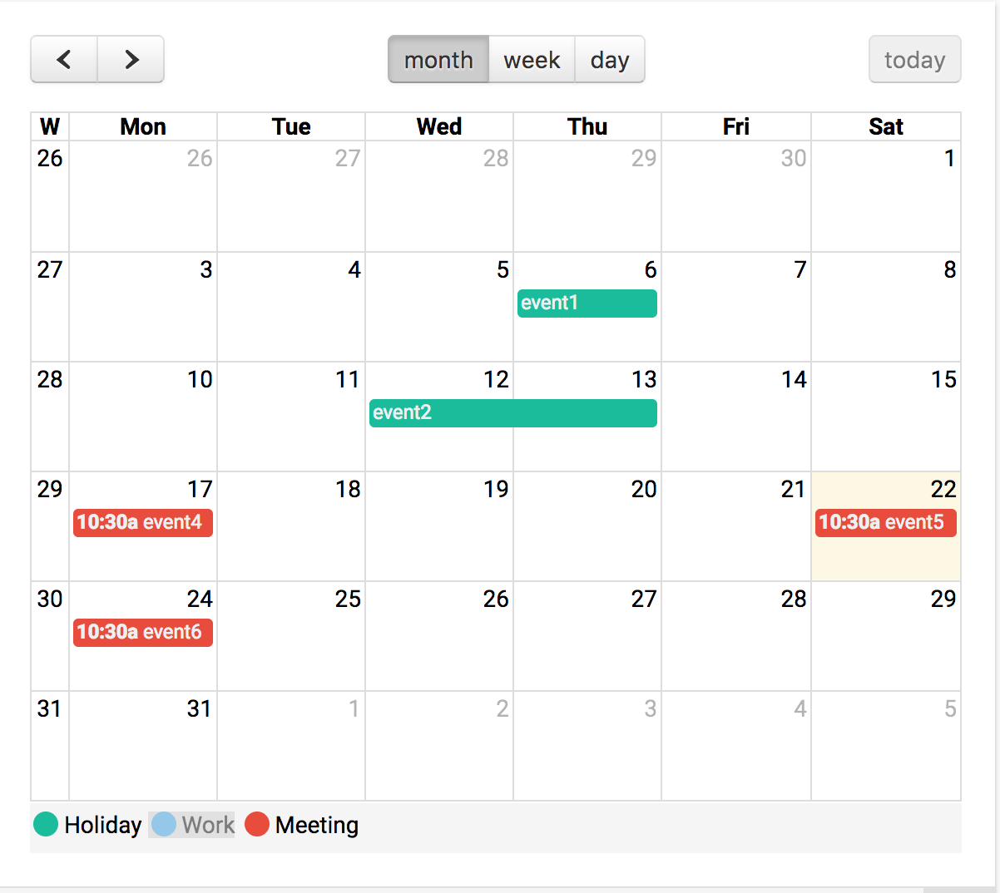

# \<scheduler-component\>

[](https://www.webcomponents.org/element/HaithemMosbahi/scheduler-component)
[](https://travis-ci.org/HaithemMosbahi/scheduler-component)
[](https://badge.fury.io/bo/scheduler-component)
[](https://gitter.im/scheduler-component)


A Polymer 2.0 custom element for managing and scheduling events. A high level wrapper for the [FullCalendar](https://fullcalendar.io) library that uses Polymer version 2.0 and ES6.

The scheduler makes it easy to configure and customize the full calendar component
in a more declarative way and without worring about the implementation details.

Being a web component that follows custom elements V1 specifications, the scheduler
can be ineroperable with other JS frameworks such as Angular and Vue.js.

## Features 

* Manage and schedule events.
* Customize and configure the scueduler using properties.
* Build advanced calendar / scheduler in a declarative manner.
* Organize events using categories ( e.g Work, Holiday, Meeting)
* Show / Hide events by selecting / deselecting categories.

## Demo
A live [demo](https://www.webcomponents.org/element/HaithemMosbahi/scheduler-component/demo/demo/index.html) of the scheduler component is hosted on webcomponents.org.



## Install
You can install this element using bower :

```
$ bower install --save HaithemMosbahi/scheduler-component
```

## Usage
1. Import the scheduler-component

Once you have installed this element, you can import it in your project using HTML import :

```html
  <link rel="import" href="bower_components/scheduler-component.html">
```

2. Start using it :

Once the element is imported , you can start using the scheduler in your application :

```html
  <scheduler-component>
  </scheduler-component>
```

So easy, isn't it ? :smiley:

## Examples

This section illustrates some use cases of the scheduler component with an inline demo.

Note that inline demo is only visible when opening the component page on [webcomponents.org](https://www.webcomponents.org/element/HaithemMosbahi/scheduler-component)

* Simple scheduler 

This example shows a simple scheduler that displays a list of events.

<!---
```
<custom-element-demo>
  <template>
    <script src="../webcomponentsjs/webcomponents-lite.js"></script>
    <link rel="import" href="scheduler-component.html">
    <next-code-block></next-code-block>
  </template>
</custom-element-demo>
```
-->
```html

<scheduler-component
          default-view="month"
          event-color="#8e44ad"
          text-color="#ecf0f1"
          events='[
            {"title" : "event1","start" : "2017-08-06"},
            {"title" : "event2","start" : "2017-08-12","end" : "2017-08-14"},
            {"title" : "event3","start" : "2017-08-15T12:30:00","allDay" :false}]'>
</scheduler-component>


```

* Editable scheduler 

This example shows how easy it is to to turn the scheduler into an edit mode by adding the editable property. Thus, events are now draggable and can be resized. Also, this example adds additional properties to customize the view :

<!---
```
<custom-element-demo>
  <template>
    <script src="../webcomponentsjs/webcomponents-lite.js"></script>
    <link rel="import" href="scheduler-component.html">
    <next-code-block></next-code-block>
  </template>
</custom-element-demo>
```
-->
```html

<scheduler-component
          default-view="month"
          editable week-numbers
          max-time="18:00:00" min-time="07:00:00"
          event-color="#8e44ad"
          text-color="#ecf0f1"
          events='[
            {"title" : "event1","start" : "2017-08-06"},
            {"title" : "event2","start" : "2017-08-12","end" : "2017-08-14"},
            {"title" : "event3","start" : "2017-08-15T12:30:00","allDay" :false}]'
            header='{"center":"title","left":"prev,next,today","right":"month,agendaWeek,agendaDay"}'>
</scheduler-component>


```

* Scheduler with categories 

The third example emphasizes the use of categories to organize events on the scheduler. Also, the categories container is a sort of legends of events that have been displayed. Events can be shown / hidden by selecting / deselecting their category.


<!---
```
<custom-element-demo>
  <template>
    <script src="../webcomponentsjs/webcomponents-lite.js"></script>
    <link rel="import" href="scheduler-component.html">
    <next-code-block></next-code-block>
  </template>
</custom-element-demo>
```
-->
```html

      <scheduler-component
         default-view="month"
          show-categories
          editable week-numbers
          all-day-text="All Day"
          event-color="#378006"
          text-color="#ecf0f1"
          hidden-days='[0]'
          max-time="18:00:00" min-time="07:00:00"
          categories='[{ "label": "Holiday", "color": "#1abc9c","hidden":false },
                       { "label": "Work", "color": "#3498db","hidden":true },
                       { "label": "Meeting", "color": "#e74c3c","hidden":false }]'
          events='[{"title" : "event1","start" : "2017-08-06","category":"Holiday"},{"title" : "event2","start" : "2017-08-12","end" : "2017-08-14","category":"Holiday"},{ "title" : "event3","start" : "2017-08-15T12:30:00","allDay" : false,"category":"Work"},{ "title" : "event4","start" : "2017-08-17T10:30:00","durationEditable":false,"category":"Meeting"},{ "title" : "event5","start" : "2017-08-22T10:30:00","durationEditable":false,"category":"Meeting"},{ "title" : "event6","start" : "2017-08-24T10:30:00","durationEditable":false,"category":"Meeting"}]'
          header='{"right":"today","left":"prev,next","center":"month,agendaWeek,agendaDay"}'>
        </scheduler-component>


```


## Properties and Methods
The scheduler component can be configured and customized like any custom element using properties and methods.

* *Attributes* 

|   Attribute   |      Type      | Default |                                              Description                                               |
| ------------- | ----------------- | ------- | ------------------------------------------------------------------------------------------------------ |
| `header` | *Object* |         | customize the header of the scheduler component.                                                                                                      |
| `events` | *Array* |     []    |  list of events to be displayed on the scheduler.                                                                                                   |
| `default-view` | *String* |     month    | The default view to be displayed on the scheduler.   
| `weekends` | *Boolean* |     true    | Whether to show the weekends or not.
| `rtl` | *Boolean* |   :false    | RTL mode.
| `hidden-days` | *Array* |     []    | List of days to be hidden.  
| `week-numbers` | *Boolean* |   :false    | Whether to show week numbers or not    
| `business-hours` | *Object* |     {}    | Object that describes scheduler business hours. 
| `height` | *string* |     {}    | Calendar's height.
| `default-date` | *Object* |     {}    | Default date to be displayed when the scheduler is opened.
| `editable` | *Boolean* |   :false    | Enable or disable edit mode.
| `droppable` | *Boolean* |   :false    | Whether to allow dropping elements on the scheduler or not.
| `event-start-editable` | *Boolean* |   :false    | Whether to allow changing event's start date.
| `event-duration-editable` | *Boolean* |   :false    | Whether to allow changing event's end date
| `all-day-slot` | *Boolean* |    true   | Whether to display the all day slot.
| `all-day-text` | *String* |     all-day    | Text to be displayed on the all day slot.
| `slot-duration` | *String* |     00:30:00    | Default slot duration. This duration will be used when a new event is added without specifing its duration. 
| `min-time` | *String* |     00:00:00    | The min time to be displayed on the scheduler.
| `max-time` | *String* |     24:00:00    | The max time to be displayed on the scheduler.
| `scroll-time` | *String* |     06:00:00    | Time on which the scroll becomes  enabled.               |
| `text-color` | *String* |   #FFFFFF     | Text color to be applied for each event. 
| `event-color` | *String* |    #3a87ad    | Background color to be applied for each event. 
| `show-categories` | *Boolean* |  :false    | Wether to show categories in the bottom of the scheduler or not. This is linked to the categories property.    
| `categories` | *Array* |    []    | events's catgories. A Category has the following properties : label (required - string ), color (string) and hidden ( default i:false, wether to show the events related to this category or not.)|  
| `selectable` | *Boolean* |    false    | Allows a user to highlight multiple days or timeslots by clicking and dragging.|  
| `select-helper` | *Boolean* |    false    | Whether to draw a "placeholder" event while the user is dragging.|      

* *Methods* 

One of the feature of the scheduler component is to provides an easy to use API in order to access to different fuctionalities that are supported by the FullCalendar library.

The list below describes methods that can be used to manipulate the scheduler :

|   Methods   |      Return Type      |   Parameters |                                           Description                                               |
| ------------- | ----------------- | ------- | ------------------------------------------------------------------------------------------------------ |
| `today` | void | -- | Navigates to the current date.                                                                                                     |
| `next` | void | -- | Navigates to the next date based on the current view.
| `prev` | void | -- | Navigates to the previous date based on the current view. 
| `getView` | string | -- | Returns the current view of the scheduler.
| `changeView` | void | viewName | Changes the view of scheduler.
| `getDate` | date | -- | Return the current date displayed on the scheduler.
| `goToDate` | void | targetDate | Navigates to the given date.
| `prevYear` | void | -- | Navigates to the next year.
| `nextYear` | void | -- | Navigates to the previous year.
| `incrementDate` | void | duration | Increments the date displayed on the scheduler by the given duration.                                                                                                    |

## Events
The scheduler element dispatches the events below :

|   Event   |      Detail      |                                              Description                                               |
| ----------------------- | -------------------- | ---------------------------------------------------------------------------------------- |
| `day-click` | *{ date, jsEvent, view }* | Fired when a day on the scheduler is clicked                                                                                                      |
| `event-click` | *{calEvent, jsEvent, view }* | Fired when an event on the scheduler is clicke                                                                                                      |
| `event-mouse-over` | *{ calEvent, jsEvent, view }* | Fired when a mouse over on event is detected                                                                                                      |
| `event-mouse-out` | *{ calEvent, jsEvent, view }* | Fired a mouse out on event is detected.                                                                              |
| `event-drag-start` | *{ event, jsEvent, ui, view }* | Fired when a drag start on event is detected.                                                                             |
| `event-drag-end` | *{ event, jsEvent, ui, view }* | Fired when a frag end on one event is detected.                                                                                   |
| `drop` | *{ date, jsEvent, ui, resourceId }* | Fired when an element is dropped on the scheduler. This is only dispatched when the droppable mode of the scheduler is set to true.                                                                                                     |
| `event-drop` | *{ event, delta, revertFunc, jsEvent, ui, view }* | Dispatched when an event element has been dropped on the scheduler.                                                                                   |
| `event-resize-start` | *{ event, jsEvent, ui, view }* | Fired when resize operation on one event is started.                                                                           |
| `event-resize-end` | *{ event, jsEvent, ui, view }* | Fired when resize operation on one event is ended.                                                                                                      |
| `event-resize` | *{ event, delta, revertFunc, jsEvent, ui, view }* | Fired when an event has been resized                                                                                   |
| `view-render` | *{ view, element }* | Dispatched when the view of the scheduler is rendered. A navigation between days, weeks or months will fire this event                                                                                    |
| `date-range-changed` | *{ start, end}* | Dispatched when the visible date range of the scheduler has changed, e.g. a navigation between days, weeks or months. Parameters are date strings in the ISO format (e.g. 2017-08-26). This event is fired in the same situations as the "view-render" event and exists for developers' convenience. |
| `view-destroy` | *{ view, element }* | Dispatched when the view is destroyed.                                                                               |
| `select` | *{ start, end, jsEvent, view }* | Dispatched when a period of time is selected by the user.                                                                               |


## RoadMap

Scheduler V 1.x

- [x] A declarative web component that wraps the fullCalendar library 

- [x] Customize and configure the scheduler using properties

- [x] Dispatch events as they occur ( click on event, click on day, change view , etc )

- [x] Organize scheduler's events using categories 
    
   - [x] Show / Hide categories in the bottom of the scheduler

   - [x] Show / Hide events when selecting / deselecting a category 

  - [x] Coloration of events based on categories

 - [ ] Add custom properties API to style the scheduler 


Scheduler V 2.x

- [ ] Add default view, create and edit templates

- [ ] Support overriding view, create and edit templates

- [ ] Extensible Themes

- [ ] Add the ability to override categories template.

For further details on the scheduler Roadmap, check out our discussion [here](https://github.com/HaithemMosbahi/scheduler-component/issues/9) or join us on [Gitter](https://gitter.im/scheduler-component).

Your ideas and suggestions are very welcome :smiley:


## Development 

First, make sure you have the [Polymer CLI](https://www.npmjs.com/package/polymer-cli) installed. Then run `polymer serve` to serve your element locally.

* Viewing Scheduler Element

```
$ polymer serve
```

* Running Tests

```
$ polymer test
```

Your application is already set up to be tested via [web-component-tester](https://github.com/Polymer/web-component-tester). Run `polymer test` to run your application's test suite locally.

## Contributing 
Comments, questions, suggestions, issues, and pull requests are all welcome.

* Fork it!
* Create your feature branch: git checkout -b my-new-feature
* Commit your changes: git commit -am 'Add some feature'
* Push to the branch: git push origin my-new-feature
* Submit a pull request :D

## History
Check out the [release](https://github.com/HaithemMosbahi/scheduler-component/releases) section

## Credits
Credits goes to the creator of [FullCalendar](https://fullcalendar.io) library.

## License
MIT License
